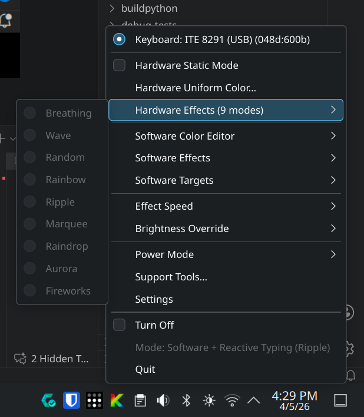
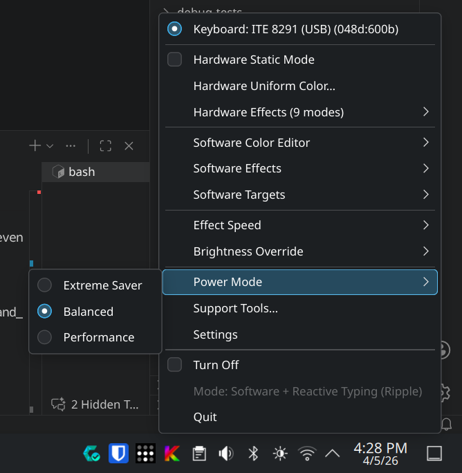
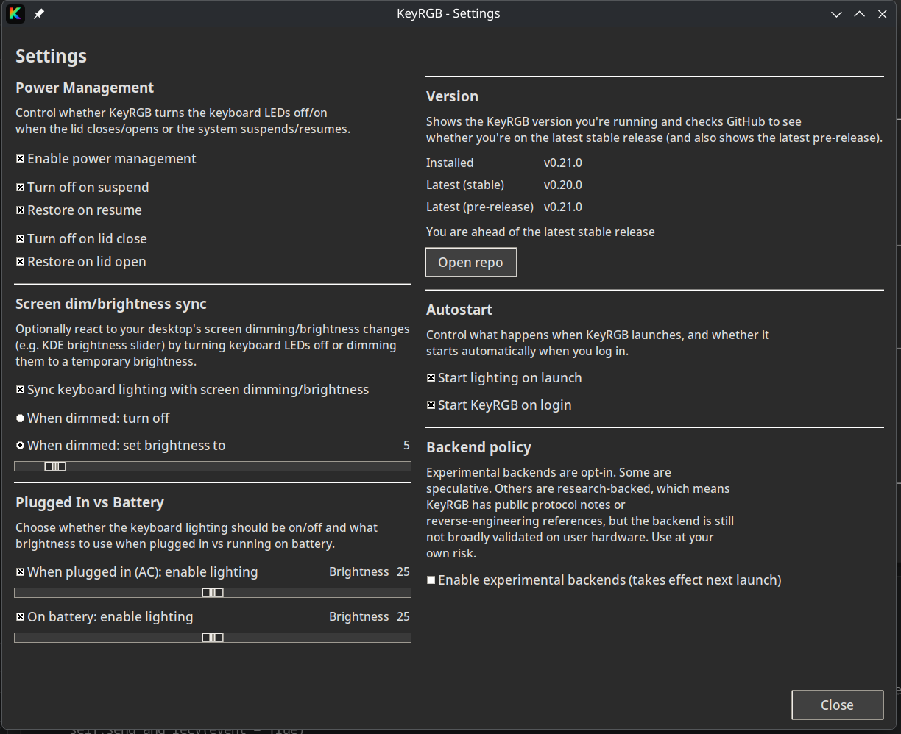
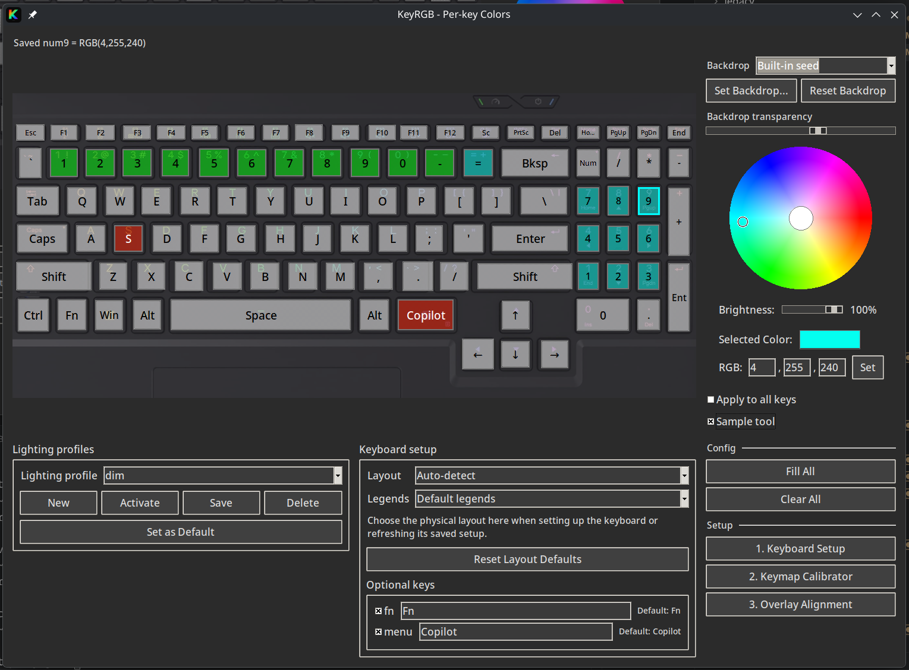

# KeyRGB

KeyRGB is a Linux tray app + per-key editor for laptop keyboard lighting.

It supports multiple backends:

- **USB (ITE 8291 / ITE8291R3 family)** on many TongFang rebrands (often per-key RGB).
- **Sysfs LED backlight devices** (brightness-only or RGB, depending on what your kernel exposes).

If OpenRGB doesn’t support your device (or is painful to operate), KeyRGB aims to be a practical alternative.

## Status

- **Beta project**: versioning follows **0.x.y** tags until the first stable release.
- **Linux-only**: primarily developed/tested on Fedora-family distros (Fedora / Nobara).
- **Hardware-specific**: support depends on your keyboard controller + firmware.
- **Per-key requires calibration**: you must build a keymap before per-key effects work.

## Screenshots









## Quickstart

### Install

On Fedora (including Nobara), the recommended path is:

```bash
./install.sh
```

The installer:

- Can be run from any working directory (it switches to the repo root internally).
- Installs a desktop launcher + autostart entry.
- Installs the udev rule for USB devices (asks for sudo).

Default mode (**recommended**) installs the AppImage to `~/.local/bin/keyrgb`.

Docs:

- Fedora / step-by-step from a blank install: [docs/usage/usage.md](docs/usage/usage.md)
- Tongfang keyboard support roadmap: [docs/architecture/tongfang/00-index.md](docs/architecture/tongfang/00-index.md)

On other distros, install the runtime deps + ensure the udev rule is present (see the docs above).

### Uninstall

If you installed via `./install.sh`, you can remove the user install with:

```bash
./uninstall.sh
```

If you installed the AppImage (default), this will prompt to remove `~/.local/bin/keyrgb`.
For non-interactive removal:

```bash
./uninstall.sh --yes --remove-appimage
```

### Run

Start the tray app:

```bash
keyrgb
```

Dev/repo mode (runs attached to your terminal):

```bash
./keyrgb
```

Open the per-key editor:

```bash
keyrgb-perkey
```

Run diagnostics (for bug reports):

```bash
keyrgb-diagnostics
```

## Commands and arguments

### Commands

| Command | What it does |
| --- | --- |
| `keyrgb` | Start the tray app. |
| `keyrgb-perkey` | Open the per-key editor. |
| `keyrgb-uniform` | Open the uniform color UI. |
| `keyrgb-calibrate` | Launch the keymap calibrator UI. |
| `keyrgb-diagnostics` | Print diagnostics JSON to stdout. |
| `./install.sh` | Install KeyRGB (AppImage/clone/pip). |
| `./uninstall.sh` | Remove a KeyRGB install created by `install.sh`. |

### `install.sh` arguments

| Argument | Meaning |
| --- | --- |
| `--appimage` | Install by downloading the AppImage (default). |
| `--pip` | Install from the current repo via `pip --user` (editable/dev). |
| `--clone` | Clone the repo, then install via `pip --user -e` (for local modifications). |
| `--clone-dir <path>` | Where to clone when using `--clone` (default: `~/.local/share/keyrgb-src`). |
| `--version <tag>` | Download a specific Git tag (e.g. `v0.8.0`). |
| `--asset <name>` | AppImage asset filename (default: `keyrgb-x86_64.AppImage`). |
| `--prerelease` | Allow auto-resolving a prerelease when it contains the newest matching AppImage (useful for debugging). |

### `install.sh` env vars

| Env var | Meaning |
| --- | --- |
| `KEYRGB_INSTALL_MODE=appimage\|clone\|pip` | Non-interactive install-mode selection. |
| `KEYRGB_CLONE_DIR=<path>` | Clone target for `--clone`. |
| `KEYRGB_ALLOW_PRERELEASE=y\|n` | Allow prereleases when auto-resolving the AppImage tag (default: `n`). |
| `KEYRGB_INSTALL_POWER_HELPER=y\|n` | Install the lightweight Power Mode helper + polkit rule. |
| `KEYRGB_INSTALL_TUXEDO=y\|n` | Enable TCC integration deps (mutually exclusive with power helper). |
| `KEYRGB_INSTALL_TCC_APP=y\|n` | If TCC integration is selected, also attempt `dnf install tuxedo-control-center` (best-effort). |

### `uninstall.sh` arguments

| Argument | Meaning |
| --- | --- |
| `--yes` | Don’t prompt (best-effort). |
| `--purge-config` | Also remove `~/.config/keyrgb`. |
| `--remove-appimage` | Remove `~/.local/bin/keyrgb` if it looks like an AppImage. |

### Runtime env vars

| Env var | Meaning |
| --- | --- |
| `KEYRGB_BACKEND=auto\|ite8291r3\|sysfs-leds` | Force a specific backend (default: auto-detect). |
| `KEYRGB_DEBUG=1` | Enable verbose debug logging. |
| `KEYRGB_TK_SCALING=<float>` | Override Tk scaling (useful for DPI/layout quirks). |

## Backend selection (multi-vendor)

KeyRGB is moving toward a multi-backend architecture so additional keyboard controllers/vendors can be supported over time.

- Auto select (default): no env vars needed.
- Force a specific backend: set `KEYRGB_BACKEND`.

Examples:

```bash
KEYRGB_BACKEND=auto keyrgb
KEYRGB_BACKEND=ite8291r3 keyrgb
KEYRGB_BACKEND=sysfs-leds keyrgb
```

Notes:

- Today, `ite8291r3` is the primary backend.
- If no backend is available, the tray/GUI should still launch (you’ll just have no hardware control).

## How per-key works

Most of these controllers expose a fixed LED matrix (often 6×21). The physical key at `(row, col)` is device-specific.

KeyRGB solves this by calibration:

1. Run the calibrator.
2. It lights one matrix cell at a time.
3. You click the corresponding key on the on-screen image.
4. Save the keymap.

After calibration, the per-key editor and effects use that mapping.

## Profiles

Profiles live under:

`~/.config/keyrgb/profiles/<profile>/`

Each profile groups:

- The keymap
- Global overlay alignment tweaks
- Per-key overlay tweaks
- Per-key colors

Use the **Profiles** section in the per-key editor to Activate/Save/Delete.

## Hardware support

KeyRGB supports multiple keyboard backlight backends.

Common examples:

- USB (ITE): typical USB IDs include `048d:600b`, `048d:6008`, `048d:6006`, etc.
- Sysfs LED: looks for common `/sys/class/leds/*kbd*` patterns; capabilities vary by device.

Support is device/firmware dependent. If you want to contribute a new laptop revision, see [CONTRIBUTING.md](CONTRIBUTING.md).

## Troubleshooting

- **No tray icon / nothing happens**: run `keyrgb` from a terminal and check logs.
- **Permission denied / cannot open device**: ensure the udev rule is installed and replug/reboot.
- **Effects “fight” or flicker**: stop other RGB tools (`openrgb`, Tuxedo tools) so there is a single owner.
- **Per-key does nothing**: you need a keymap. Open `keyrgb-perkey` and click **Run Keymap Calibrator**.

## Settings

The tray menu includes a **Settings** entry which opens a small GUI for:

- **Power Management**: turn keyboard LEDs off/on on suspend/resume and lid close/open.
- **Screen Dim Sync** (KDE Plasma / Wayland): sync keyboard lighting to screen dimming; can either turn off or dim to a temporary brightness, and will turn off when the screen is powered off.
- **Autostart**:
	- **Start lighting on launch** (KeyRGB behavior at startup)
	- **Start KeyRGB on login** (OS session autostart via `~/.config/autostart/keyrgb.desktop`)

If you quit the tray during a session, you can re-open it from your desktop app menu by searching for **KeyRGB**.

## Getting your hardware supported

If KeyRGB doesn’t control your keyboard yet (or behaves oddly), please open a GitHub issue and include the information below.
This is the fastest way to let us map your laptop revision to the right backend/quirks.

Open an issue here:

- [GitHub Issues (new issue)](../../issues/new/choose)

Choose **Hardware support / diagnostics** for new laptop models, or **Bug report** for problems on already-supported hardware.

### 1) Run diagnostics

Run:

```bash
keyrgb-diagnostics
```

Paste the full JSON output into the issue.

What it includes (read-only):

- DMI identity (`sys_vendor`, `product_name`, `board_name`)
- Candidate sysfs LED nodes (keyboard backlight paths)
- USB IDs (best-effort enumeration)

### 2) Run KeyRGB with debug logs

```bash
KEYRGB_DEBUG=1 keyrgb
```

Then:

- Describe what you clicked (tray menu items, GUI actions)
- Paste any errors/warnings from the terminal

### 3) If USB is involved, also paste this

```bash
lsusb | grep -i "048d:" || true
```

### 4) What to mention in plain English

- Laptop brand + model name you bought (e.g. WootBook / Tuxedo / XMG)
- What works vs what doesn’t (brightness, effects, per-key)
- Any quirks (e.g. “after resume it switches to rainbow and ignores settings”)

### Privacy note

`keyrgb-diagnostics` does not include usernames or home directory paths.
If you still prefer to redact, you can replace DMI values with `REDACTED` while keeping their *presence* and structure.

More troubleshooting and setup details are in [docs/usage/usage.md](docs/usage/usage.md).

## Optional dependencies

- `PyQt6` is used for optional slider dialogs in the tray UI. KeyRGB still runs without it.
	- Install it with `python3 -m pip install --user "PyQt6>=6.10.0"` or `python3 -m pip install --user -e ".[qt]"`.

## License

GPL-2.0-or-later. See [LICENSE](LICENSE).
