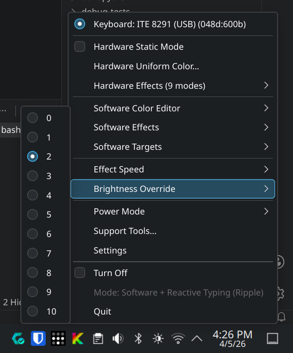
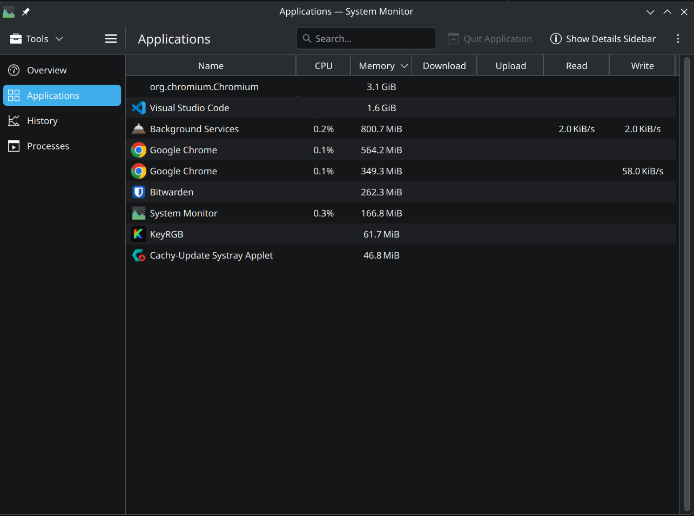
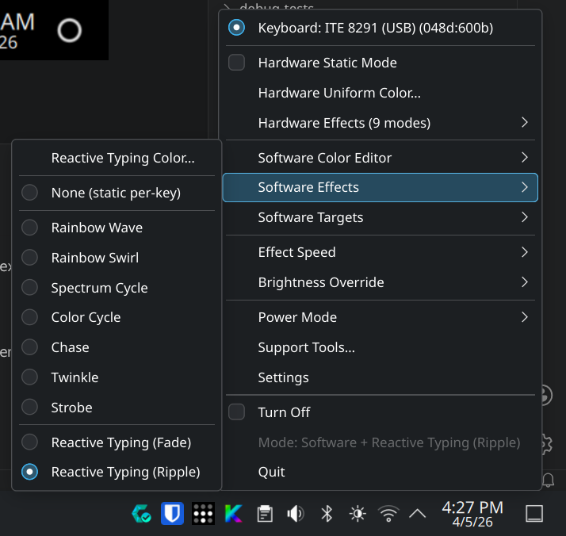
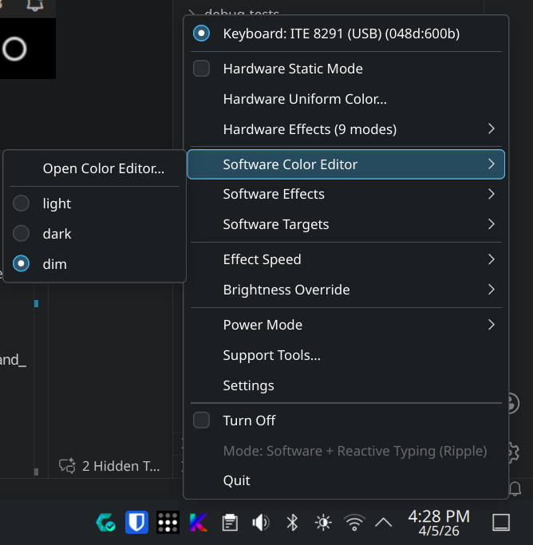
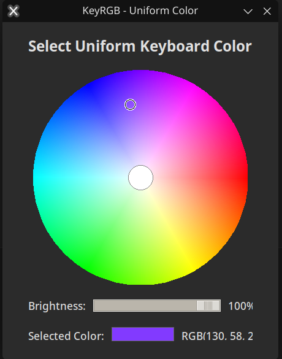
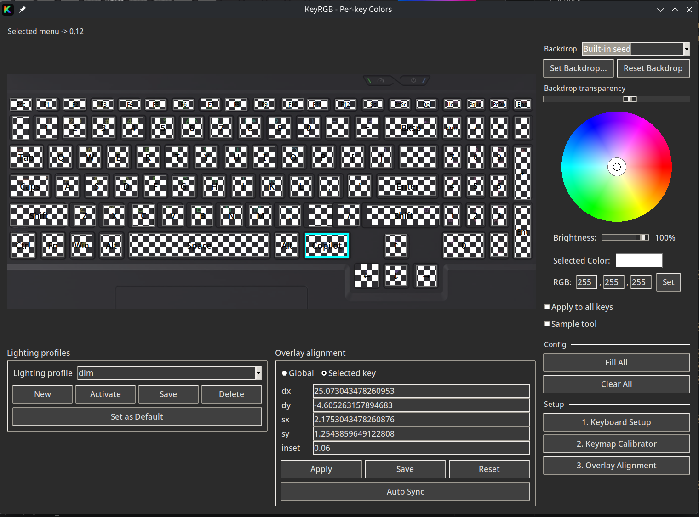
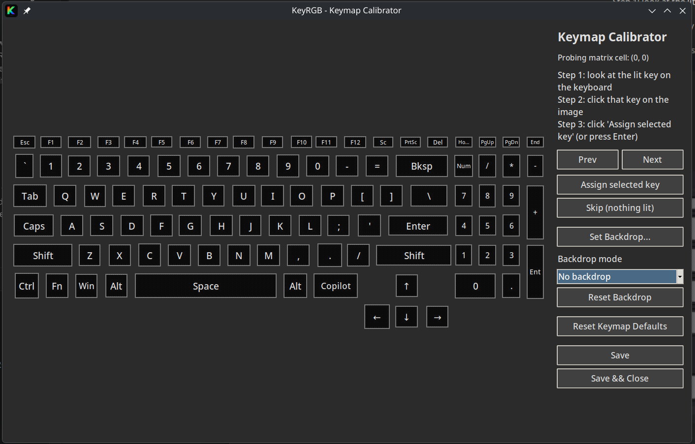

# KeyRGB

KeyRGB is a lightweight Linux tray app and per-key editor for laptop keyboard lighting. It serves as a practical, focused alternative to OpenRGB for supported devices.

## Supported Backends & Devices

KeyRGB uses a priority-based system to select the best driver for your hardware:

1.  **Kernel Driver (Preferred)**: Uses safe, native Linux kernel interfaces (`/sys/class/leds`).
    *   **Clevo / Tuxedo**: Full RGB support via `tuxedo-drivers` or `clevo-xsm-wmi`.
    *   **System76**: Full RGB support via standard ACPI drivers.
    *   **Universal**: Brightness control for almost any laptop (Dell, ASUS, HP, etc.).

2.  **USB Direct (Fallback)**: Uses the `ite8291r3` userspace driver.
    *   **TongFang**: Supports per-key RGB on devices without kernel drivers (XMG, Wootbook, Eluktronics, older Tuxedo models).

*The installer (`install.sh`) can optionally help you install the necessary kernel modules for Clevo/Tuxedo laptops.*

## Status

- **Beta**: versioning follows **0.x.y**.
- Developed primarily on Fedora / Nobara.
- Installer support is **best-effort** on other distros via common package managers (dnf/apt/pacman/zypper/apk).
- Support depends entirely on your specific keyboard controller and firmware.

## Screenshots

<table>
	<tr>
		<td width="50%">
			<b>Tray Menu (Effects)</b><br>
			
		</td>
		<td width="50%">
			<b>Power Management</b><br>
			
		</td>
	</tr>
	<tr>
		<td width="50%">
			<b>Per-Key Editor</b><br>
			
		</td>
		<td width="50%">
			<b>Settings</b><br>
			
		</td>
	</tr>
	<tr>
		<td width="50%">
			<b>Tray Menu (Brightness)</b><br>
			
		</td>
		<td width="50%">
			<b>RAM / CPU Usage</b><br>
			
		</td>
	</tr>
</table>

<details>
<summary><b>More screenshots</b></summary>

<table>
	<tr>
		<td width="50%">
			<b>Tray Menu (Software Effects)</b><br>
			
		</td>
		<td width="50%">
			<b>Tray Menu (Keyboard / Profiles)</b><br>
			
		</td>
	</tr>
	<tr>
		<td width="50%">
			<b>Uniform Color UI</b><br>
			
		</td>
		<td width="50%">
			<b>Per-Key Calibrator</b><br>
			
		</td>
	</tr>
	<tr>
		<td width="50%">
			<b>Keymap Calibration</b><br>
			
		</td>
		<td width="50%"></td>
	</tr>
</table>

</details>

## Quickstart

### Install

#### Option A: One-line interactive install (recommended)

Downloads and runs the latest installer script (no clone). By default, the installer auto-selects the latest stable AppImage.

```bash
curl -fsSL https://raw.githubusercontent.com/Rainexn0b/keyRGB/main/install.sh -o install.sh && bash install.sh
```

If you don't want the installer to attempt system package installs (no sudo / minimal / immutable OS):

```bash
curl -fsSL https://raw.githubusercontent.com/Rainexn0b/keyRGB/main/install.sh -o install.sh && bash install.sh --no-system-deps
```

#### Automated AppImage update (non-interactive)

Updates an existing AppImage install by replacing `~/.local/bin/keyrgb` with the newest matching release. Uses the last saved release channel (stable vs prerelease) unless overridden.

```bash
curl -fsSL https://raw.githubusercontent.com/Rainexn0b/keyRGB/main/install.sh -o install.sh && bash install.sh --update-appimage
```

#### Option B: Install from a local checkout (dev / local mods)

If you already cloned the repo:

```bash
./install.sh
```

Notes:

- Fedora / Nobara is the primary supported target.
- Other distros are best-effort via common package managers (dnf/apt/pacman/zypper/apk).
- The installer installs the app launcher + autostart, and may prompt for sudo to install udev rules needed for hardware access.

Docs:

- Step-by-step from a blank install: [docs/usage/usage.md](docs/usage/usage.md)
- Commands / entrypoints / env vars: [docs/usage/commands.md](docs/usage/commands.md)
- Architecture / TongFang support roadmap: [docs/architecture/tongfang/00-index.md](docs/architecture/tongfang/00-index.md)

### Uninstall

#### One-line uninstall (no clone)

Downloads and runs the latest uninstaller script:

```bash
curl -fsSL https://raw.githubusercontent.com/Rainexn0b/keyRGB/main/uninstall.sh -o uninstall.sh && bash uninstall.sh
```

#### Uninstall from a local checkout

```bash
# Interactive removal
./uninstall.sh

# Non-interactive (scripted)
./uninstall.sh --yes --remove-appimage
```

### Run

If you installed via the installer, run KeyRGB from your app menu or start it from a terminal:

| Command | Description |
| --- | --- |
| `keyrgb` | Start the tray app (background). |
| `./keyrgb` | Run attached to terminal (dev mode). |
| `keyrgb-perkey` | Open the per-key editor. |
| `keyrgb-uniform` | Open the uniform-color GUI. |
| `keyrgb-reactive-color` | Open the reactive typing color GUI. |
| `keyrgb-calibrate` | Open the keymap calibrator UI. |
| `keyrgb-settings` | Open the settings GUI. |
| `keyrgb-tcc-profiles` | Open the TCC power profiles GUI (if `tccd` is available). |
| `keyrgb-diagnostics` | Print hardware diagnostics JSON. |

## Configuration

### Settings and autostart

Access **Settings** via the tray menu to configure:

- **Power Management**: toggle LEDs on Suspend/Resume or Lid Close/Open.
- **Screen Dim Sync**: optionally sync keyboard brightness with desktop-driven screen dimming/brightness changes (e.g. KDE brightness slider).
- **Autostart**: enable “Start KeyRGB on login”.

### Profiles

Profiles are stored in:

`~/.config/keyrgb/profiles/`

Each profile contains the keymap (calibration), global overlay tweaks, and per-key color data. Manage these via the Per-Key Editor.

### Per-key calibration

Most supported controllers use a fixed LED matrix (e.g., 6×21). To map this to your physical layout:

1. Open `keyrgb-perkey`.
2. Click **Run Keymap Calibrator**.
3. Click the corresponding key on-screen as each physical LED lights up.
4. Save the keymap.

## Troubleshooting

| Issue | Solution |
| --- | --- |
| No tray icon | Run `keyrgb` from a terminal to see errors. Check if the system tray extension is enabled (GNOME). |
| Permission denied | Ensure udev rules are installed. Try replugging the device or rebooting. |
| Flickering effects | Ensure other tools (OpenRGB, TCC) are not running. KeyRGB needs exclusive access. |
| Per-key not working | You likely need to run the Keymap Calibrator first. |

## Advanced usage

### Installer arguments

| Argument | Meaning |
| --- | --- |
| `--appimage` | Download AppImage (default). |
| `--pip` | Install via `pip --user` (dev/editable). |
| `--clone` | Clone repo and install via pip (source). |
| `--version <tag>` | Install specific tag (e.g. `v0.9.3`). |
| `--no-system-deps` | Skip best-effort system dependency installation. |
| `--update-appimage` | Non-interactive: update an existing AppImage install (downloads latest and replaces `~/.local/bin/keyrgb`). |

### Environment variables

| Variable | Usage |
| --- | --- |
| `KEYRGB_BACKEND` | Force backend: `auto` (default), `ite8291r3`, or `sysfs-leds`. |
| `KEYRGB_DEBUG=1` | Enable verbose debug logging for bug reports. |
| `KEYRGB_TK_SCALING` | Float override for UI scaling (fixes High-DPI quirks). |

## Hardware support and contributing

If KeyRGB detects your device but behaves oddly, or if you have a new laptop model (TongFang/Clevo/etc.), please help us support it.

1) Run diagnostics:

```bash
keyrgb-diagnostics
```

2) Open an issue:

- https://github.com/Rainexn0b/keyRGB/issues/new/choose

Select **Hardware support / diagnostics** and paste the JSON output from step 1.

3) Include details:

- Laptop model (e.g., XMG Core 15, Tuxedo InfinityBook)
- USB ID (run `lsusb | grep -i "048d:"`)
- Description of what works vs. what fails

### Privacy note

`keyrgb-diagnostics` attempts to sanitize output, but please review the JSON before posting to ensure no personal paths/names are included.

## License

GPL-2.0-or-later.
