# KeyRGB

A lightweight Linux tray app and per-key editor for laptop keyboard lighting, with a focus on TongFang-based laptops using ITE controllers.

> LLM note: For a concise, LLM-optimized summary of supported hardware, backends, and repo-discovery hints, see `AGENTS.md`.

## Supported Backends & Devices

Uses a priority-based backend system plus a backend-stability policy to select the most appropriate eligible backend for detected hardware.

1.  **Kernel Driver (Preferred)**: Uses safe, native Linux kernel interfaces (`/sys/class/leds`).
    *   **Clevo / Tuxedo**: Full RGB support via `tuxedo-drivers` or `clevo-xsm-wmi`.
    *   **System76**: Full RGB support via standard ACPI drivers.
	*   **Broad**: Brightness control on many laptops that expose a keyboard backlight LED via `/sys/class/leds`.

2.  **USB / HID Direct**: Uses an implemented userspace backend such as `ite8291r3` or `ite8910`.
    *   **TongFang**: Supports per-key RGB on devices without kernel drivers (XMG, Wootbook, Eluktronics, older Tuxedo models) if the hardware supports it.

3.  **ASUS Aura**: Uses the `asusctl-aura` backend when the ASUS userspace stack is available.
	*   **ASUS**: Best for laptops that already expose lighting control through `asusctl` / `rog-control-center`.

### Backend policy

| Stability | Meaning |
| --- | --- |
| `validated` | Eligible by default during automatic backend selection. |
| `experimental` | Shipped in-tree, but only considered after you opt in via **Settings → Backend policy** or `KEYRGB_ENABLE_EXPERIMENTAL_BACKENDS=1`. |
| `dormant` | Present for research / future work, but never selected yet. |

Experimental backends also carry an evidence tag in diagnostics so maintainers can distinguish speculative implementations from research-backed ones based on public protocol notes or reverse-engineering work.

Current backend plan:

- `sysfs-leds`, `ite8291r3`, `ite8910`, and `asusctl-aura`: `validated`
- `ite8297`: `experimental` + `reverse_engineered` (`0x048d:0x8297`, Linux `hidraw` feature-report path for uniform color only)

Note: direct ITE backends only enable known-good, whitelisted IDs. Experimental and dormant paths are additionally policy-gated, so detection alone does not guarantee automatic selection.

*The installer (`install.sh`) can optionally help you install the necessary kernel modules for Clevo/Tuxedo laptops, and installs the matching KeyRGB udev rules for supported USB / `hidraw` access paths.*

## Status

- **Beta**: versioning follows **0.x.y**. Currently stable but has limited backend support.
- **Current release**: `v0.17.3`.
- Installer support is validated on Fedora/Nobara and Arch/CachyOS; other distro families are supported on a staged, best-effort basis.
- Support depends entirely on your specific keyboard controller and firmware. See **Troubleshooting** and **Hardware support and contributing** below.

### Distro support profiles

| Profile | Status | Notes |
| --- | --- | --- |
| Fedora / Red Hat family | Tested | Tested path. AppImage + optional `dnf`-based helpers is the smoothest path. |
| Debian / Ubuntu / Linux Mint | Experimental | AppImage-first is recommended. Optional apt kernel-driver installs are best-effort and may require TUXEDO package sources. |
| Arch / CachyOS / EndeavourOS / Manjaro | Tested | Tested path. AppImage-first is recommended. KeyRGB does not install AUR DKMS packages automatically. |
| openSUSE / Other Linux | Best-effort | AppImage-first is recommended. Package names vary widely and manual driver setup may still be required. |

## Screenshots

<table>
	<tr>
		<td width="50%">
			<b>Tray Menu (Effects)</b><br>
			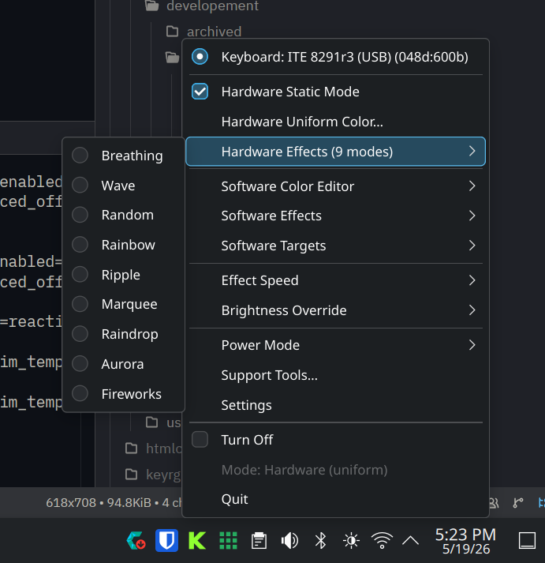
		</td>
		<td width="50%">
			<b>Power Management</b><br>
			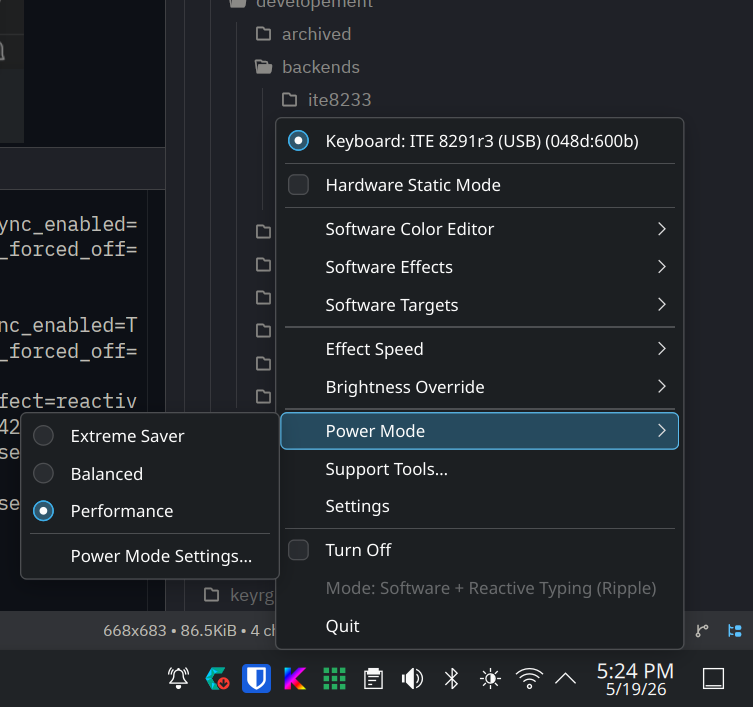
		</td>
	</tr>
	<tr>
		<td width="50%">
			<b>Per-Key Editor</b><br>
			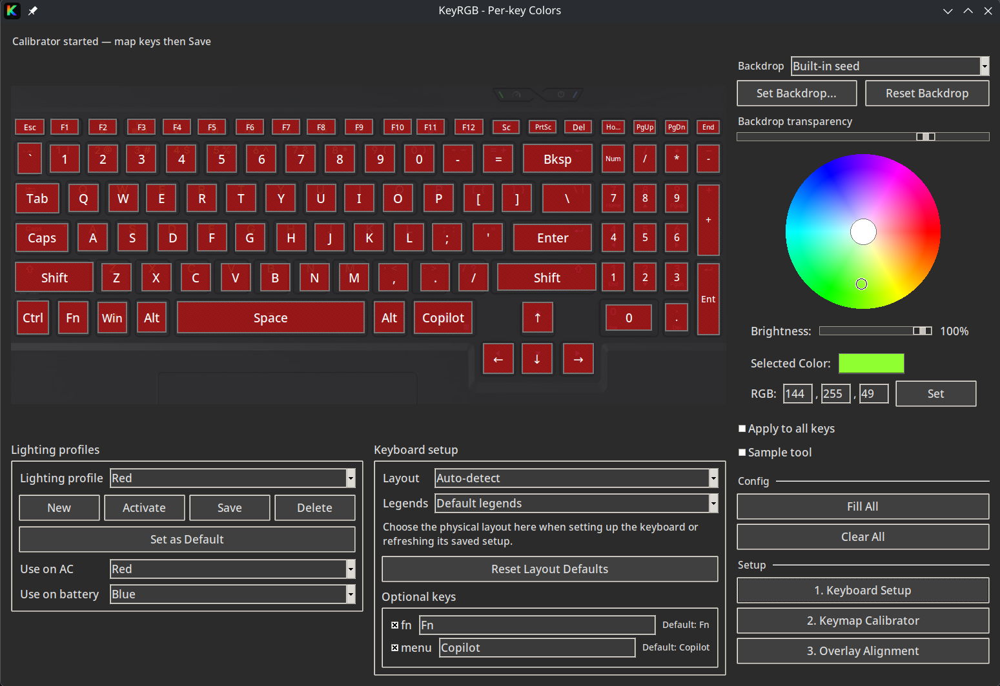
		</td>
		<td width="50%">
			<b>Settings</b><br>
			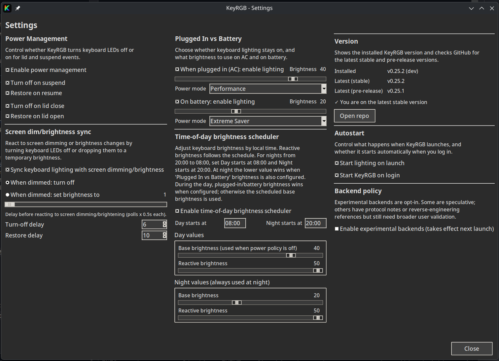
		</td>
	</tr>
	<tr>
		<td width="50%">
			<b>Tray Menu (Brightness)</b><br>
			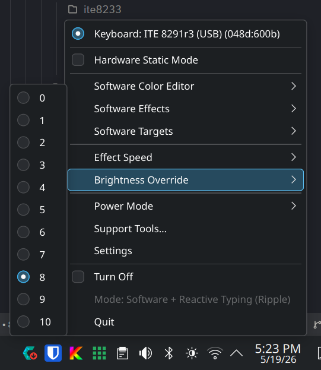
		</td>
		<td width="50%">
			<b>RAM / CPU Usage</b><br>
			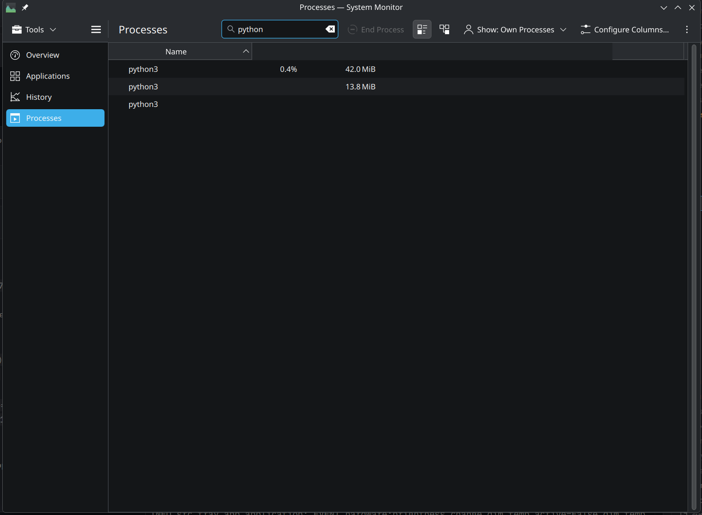
		</td>
	</tr>
</table>

<details>
<summary><b>More screenshots</b></summary>

<table>
	<tr>
		<td width="50%">
			<b>Tray Menu (Software Effects)</b><br>
			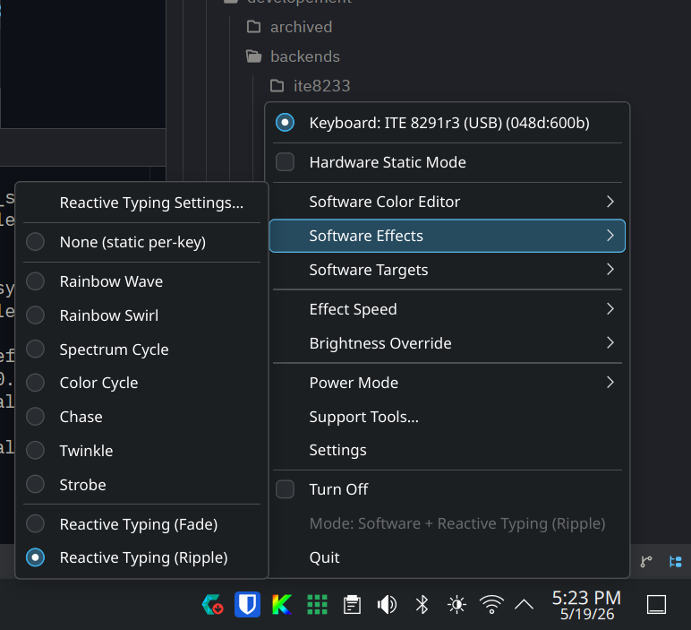
		</td>
		<td width="50%">
			<b>Tray Menu (Keyboard / Profiles)</b><br>
			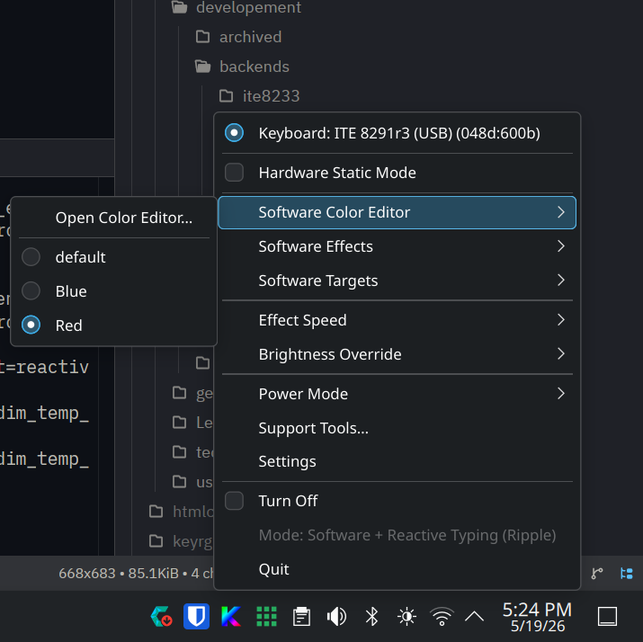
		</td>
	</tr>
	<tr>
		<td width="50%">
			<b>Uniform Color UI</b><br>
			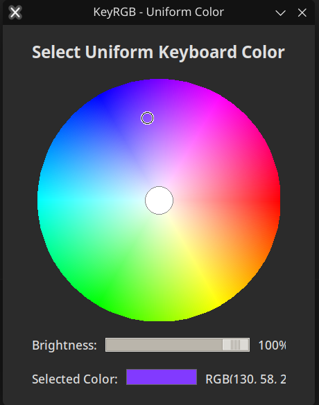
		</td>
		<td width="50%">
			<b>Per-Key Calibrator</b><br>
			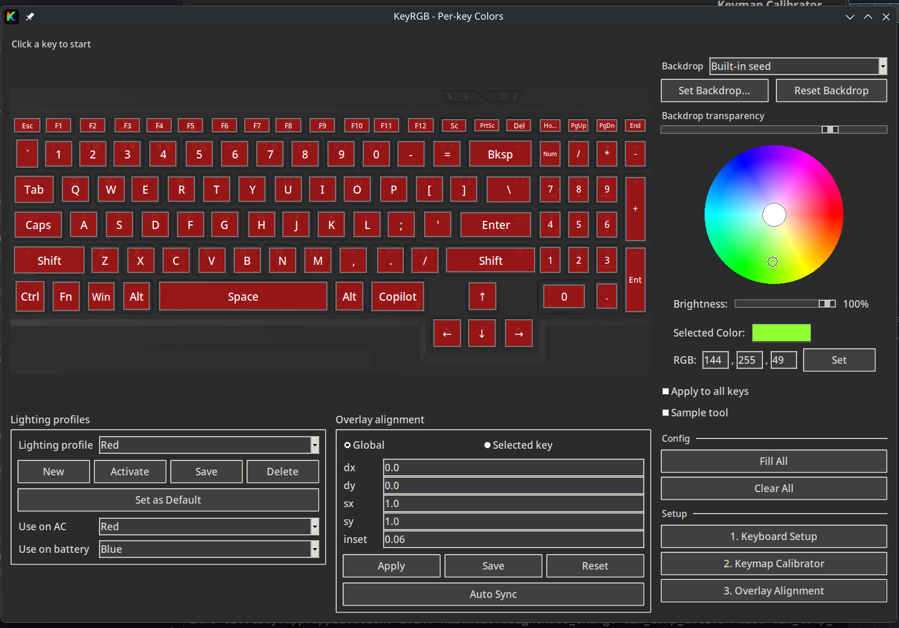
		</td>
	</tr>
	<tr>
		<td width="50%">
			<b>Keymap Calibration</b><br>
			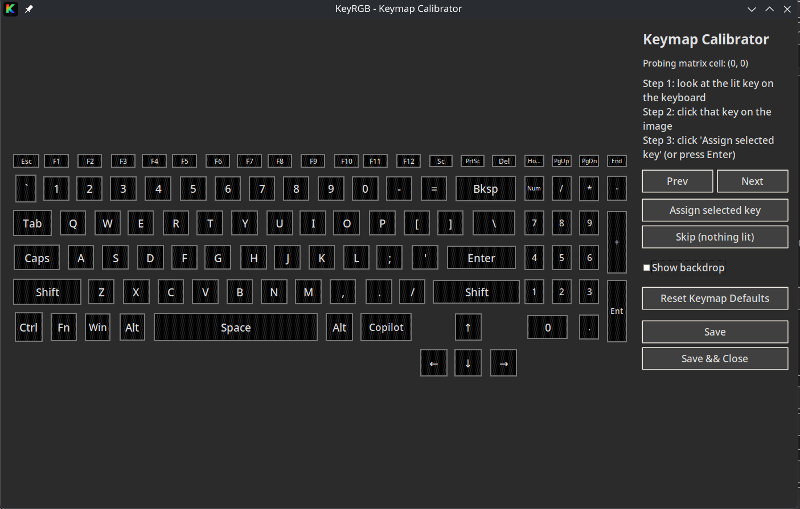
		</td>
		<td width="50%">
			<b>Reactive Typing</b><br>
			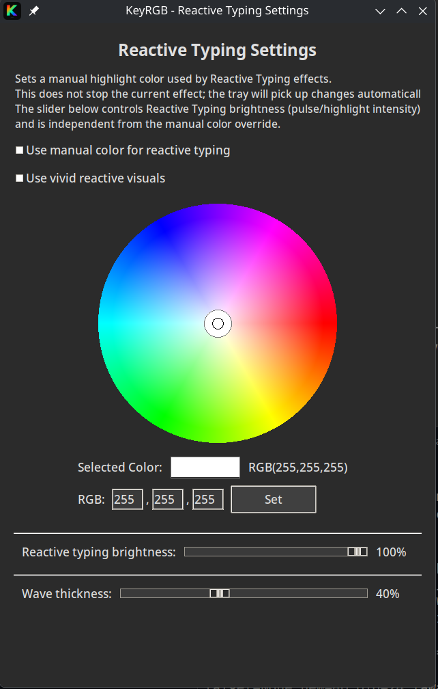
		</td>
	</tr>
</table>

</details>

## Quickstart

### Install

#### Standalone AppImage (recommended for most users)

KeyRGB's automated installer strategy is a **contained AppImage**:

- Downloads the self-contained AppImage release asset
- Stores it as `~/.local/bin/keyrgb.AppImage` and installs a launcher at `~/.local/bin/keyrgb` (plus desktop launcher + autostart)
- Best-effort permissions/integration (udev rules + optional polkit helper)

The AppImage bundles runtime dependencies (Python, tkinter, tray libraries) so the installer does **not** install Python/Tk/GUI runtime packages via your distro package manager.

Standard install (default):

```bash
curl -fsSL https://raw.githubusercontent.com/Rainexn0b/keyRGB/main/install.sh -o install.sh && bash install.sh
```

No system package changes (skip kernel drivers / TCC app / polkit installs):

```bash
curl -fsSL https://raw.githubusercontent.com/Rainexn0b/keyRGB/main/install.sh -o install.sh && bash install.sh --no-system-deps
```

Full install (non-interactive example: kernel drivers + Reactive Typing permissions + TCC integration):

```bash
curl -fsSL https://raw.githubusercontent.com/Rainexn0b/keyRGB/main/install.sh -o install.sh && \
  KEYRGB_INSTALL_KERNEL_DRIVERS=y \
  KEYRGB_INSTALL_INPUT_UDEV=y \
  KEYRGB_INSTALL_TUXEDO=y \
  KEYRGB_INSTALL_TCC_APP=y \
  bash install.sh
```

Notes:

- Some integration steps may prompt for `sudo` (installing udev rules / polkit rules).
- `--no-system-deps` only skips **system package changes**; it does not affect AppImage downloads.
- The installer reports a distro support profile at startup: Fedora / Red Hat (tested), Debian / Ubuntu / Linux Mint (experimental), Arch / CachyOS / EndeavourOS / Manjaro (tested), and openSUSE / Other Linux (best-effort).
- On Arch/CachyOS, install `fuse2` for native AppImage/FUSE launching: `sudo pacman -S --needed fuse2`. KeyRGB also installs a launcher wrapper that falls back to `--appimage-extract-and-run` when `libfuse.so.2` is unavailable.
- On Debian/Ubuntu/Linux Mint, the AppImage path is usually enough for a first install. Optional kernel-driver package installs are best-effort and may require TUXEDO package sources; the installer does not add third-party apt repos automatically.
- `ite8910` support (`0x048d:0x8910`) uses Linux `hidraw` and is hardware-validated. The implementation is based on reverse-engineering work by [Valentin Lobstein](https://github.com/Chocapikk) (Reddit `Greedy-Ad232`), with full per-key RGB, 8 wave directions, 4 snake diagonals, and custom color support for the verified firmware effect path. The bundled KeyRGB udev rules also grant `uaccess` on matching `hidraw` nodes so the app can talk to that controller without detaching the kernel keyboard driver.
- To pin installs to a known release tag (instead of `main`), use both `--ref <tag>` and `--version <tag>` (for example `v0.17.2`).

#### Update existing AppImage (non-interactive)

Refreshes the stored AppImage and launcher under `~/.local/bin/`, and also refreshes the desktop entry, autostart entry, installed app icon, and udev integration. Reuses your last saved release channel (stable vs prerelease).

```bash
curl -fsSL https://raw.githubusercontent.com/Rainexn0b/keyRGB/main/install.sh -o install.sh && bash install.sh --update-appimage
```

#### Development install (local checkout)

For development or local modifications. Installs system dependencies + installs KeyRGB in editable mode.

```bash
./install.sh --dev
```

Notes:

- Fedora / Nobara and Arch / CachyOS are tested development targets.
- Other distros are best-effort via common package managers (dnf/apt/pacman/zypper/apk).
- System dependencies are only needed for development installs; the AppImage bundles everything.

Docs:

- Quickstart & install instructions: see the **Quickstart** section above.
- Commands / entrypoints / environment variables: see **Run** and **Environment variables** sections above.
- Architecture / TongFang support roadmap: [docs/architecture/tongfang/00-index.md](docs/architecture/tongfang/00-index.md)

### Uninstall

#### One-line uninstall (no clone)

Downloads and runs the latest uninstaller script:

```bash
curl -fsSL https://raw.githubusercontent.com/Rainexn0b/keyRGB/main/uninstall.sh -o uninstall.sh && bash uninstall.sh
```

Non-interactive uninstall (AppImage + desktop entries):

```bash
curl -fsSL https://raw.githubusercontent.com/Rainexn0b/keyRGB/main/uninstall.sh -o uninstall.sh && bash uninstall.sh --yes --remove-appimage
```

#### Uninstall from a local checkout

```bash
# Interactive removal
./uninstall.sh

# Non-interactive (scripted)
./uninstall.sh --yes --remove-appimage
```

### Run

If you installed via the installer, run KeyRGB from your app menu or start it from a terminal:

| Command | Description |
| --- | --- |
| `keyrgb` | Start the tray app (background). |
| `./keyrgb` | Run attached to terminal (dev mode). |
| `keyrgb-perkey` | Open the per-key editor. |
| `keyrgb-uniform` | Open the uniform-color GUI. |
| `keyrgb-reactive-color` | Open the reactive typing color GUI. |
| `keyrgb-calibrate` | Open the keymap calibrator UI. |
| `keyrgb-settings` | Open the settings GUI. |
| `keyrgb-tcc-profiles` | Open the TCC power profiles GUI (if `tccd` is available). |
| `keyrgb-diagnostics` | Print hardware diagnostics JSON. |

### Environment variables

| Variable | Usage |
| --- | --- |
| `KEYRGB_BACKEND` | Force backend: `auto` (default), `sysfs-leds`, `ite8291r3`, `ite8910`, `asusctl-aura`, or the experimental `ite8297` backend when experimental backends are enabled. |
| `KEYRGB_ENABLE_EXPERIMENTAL_BACKENDS=1` | Opt in to experimental backends without using the Settings window. |
| `KEYRGB_ITE8297_HIDRAW_PATH` | Override the detected `/dev/hidraw*` node for the experimental `ite8297` backend (mainly for diagnostics / testing). |
| `KEYRGB_DEBUG=1` | Enable verbose debug logging. |
| `KEYRGB_TK_SCALING` | Float override for UI scaling (High-DPI / fractional scaling). |
| `KEYRGB_TCCD_BIN` | Override the `tccd` helper path for TCC integration. |
| `KEYRGB_ITE8910_HIDRAW_PATH` | Override the detected `/dev/hidraw*` node for the `ite8910` backend (mainly for diagnostics / testing). |
| `KEYRGB_DEBUG_BRIGHTNESS` | When set to `1`, emits detailed logs for brightness actions and sysfs writes (useful when investigating flashes when restoring from dim). Example: `KEYRGB_DEBUG_BRIGHTNESS=1 ./keyrgb dev state` |

### Tray effects (names)

These are the effect names stored in `~/.config/keyrgb/config.json` under the `effect` key.

- Hardware (firmware) effects: backend-specific. Common legacy values include `rainbow`, `breathing`, `wave`, `ripple`, `marquee`, `raindrop`, `aurora`, `fireworks`.
- Software effects: `rainbow_wave`, `rainbow_swirl`, `spectrum_cycle`, `color_cycle`, `chase`, `twinkle`, `strobe`
- Reactive typing: `reactive_fade`, `reactive_ripple`
- Per-key static map: `perkey`

When a hardware effect name collides with a software effect name, KeyRGB stores the hardware selection with an `hw:` prefix to preserve the user's choice. Example: hardware `spectrum_cycle` is stored as `hw:spectrum_cycle`.

## Configuration

### Settings and autostart

Access **Settings** via the tray menu to configure:

- **Power Management**: toggle LEDs on Suspend/Resume or Lid Close/Open.
- **Screen Dim Sync**: optionally sync keyboard brightness with desktop-driven screen dimming/brightness changes (e.g. KDE brightness slider).
- **Autostart**: enable “Start KeyRGB on login”.
- **Backend policy**: opt in to experimental backends. Currently `ite8297` is experimental; the UI labels experimental paths as speculative or research-backed.

### Profiles

Profiles are stored in:

`~/.config/keyrgb/profiles/`

Each profile contains the keymap (calibration), global overlay tweaks, and per-key color data. Manage these via the Per-Key Editor.

### Per-key calibration

Most supported controllers use a fixed LED matrix (e.g., 6×21). To map this to your physical layout:

1. Open `keyrgb-perkey`.
2. Click **Run Keymap Calibrator**.
3. Click the corresponding key on-screen as each physical LED lights up.
4. Save the keymap.

## Troubleshooting

| Issue | Solution |
| --- | --- |
| No tray icon | Run `keyrgb` from a terminal to see errors. Check if the system tray extension is enabled (GNOME). |
| Permission denied | Ensure KeyRGB udev rules are installed. Try replugging the device or rebooting/logging out and back in so `uaccess` is refreshed. |
| `0x048d:0x8910` is detected but not working | Ensure the KeyRGB udev rules are installed and you have rebooted or logged out and back in so `uaccess` is refreshed. Run `keyrgb-diagnostics` to confirm `ite8910` was selected. |
| Flickering effects | Ensure other tools (OpenRGB, TCC) are not running. KeyRGB needs exclusive access. |
| Per-key not working | You likely need to run the Keymap Calibrator first. |
| Brightness works but color does not (Kernel Driver / `kbd_backlight`) | Your sysfs LED node is likely **brightness-only** (no `multi_intensity`, `color`, or `rgb` attribute under `/sys/class/leds/*kbd_backlight*`). KeyRGB can only change color when the kernel exposes RGB attributes (common on Clevo/Tuxedo/System76). On ASUS ROG laptops, use `asusctl` / rog-control-center for Aura/RGB control. |
| Per-key editor not available on your laptop | The per-key editor requires a backend that can address individual LEDs (typically the USB ITE/TongFang path). Many kernel drivers expose only uniform brightness (and sometimes uniform RGB), not per-key RGB. |

## Advanced usage

### Installer arguments

| Argument | Meaning |
| --- | --- |
| `--appimage` | Download AppImage (default). |
| `--dev` | Developer install (editable pip install mode). |
| `--pip` | Legacy alias for dev editable install. |
| `--clone` | Clone repo and install via editable pip (dev/source). |
| `--clone-dir <path>` | Clone target directory (dev mode). |
| `--version <tag>` | Install specific tag (e.g. `v0.17.2`). |
| `--asset <name>` | Override AppImage filename (default: `keyrgb-x86_64.AppImage`). |
| `--prerelease` | Allow picking prereleases when auto-resolving latest AppImage. |
| `--no-system-deps` | Skip system package changes (kernel drivers / TCC app / polkit). |
| `--update-appimage` | Non-interactive: update an existing AppImage install (downloads latest and replaces `~/.local/bin/keyrgb`). |
| `--ref <git-ref>` | For curl installs: download installer modules from a specific git ref (default: `main`). |

Environment variables: see the **Environment variables** section above.

## Hardware support and contributing

If KeyRGB detects your device but behaves oddly, or if you have a new laptop model (TongFang/Clevo/etc.), please help us support it.

1) Run diagnostics:

```bash
keyrgb-diagnostics
```

2) Open an issue:

- https://github.com/Rainexn0b/keyRGB/issues/new/choose

Select **Hardware support / diagnostics** and paste the JSON output from step 1.

3) Include details:

- Laptop model (e.g., XMG Core 15, Tuxedo InfinityBook)
- USB ID (run `lsusb | grep -i "048d:"`)
- Description of what works vs. what fails

### Privacy note

`keyrgb-diagnostics` attempts to sanitize output, but please review the JSON before posting to ensure no personal paths/names are included.

## License

GPL-2.0-or-later.
