# KeyRGB

A lightweight Linux tray app and per-key editor for laptop keyboard lighting.
Primary target is TongFang-based laptops with ITE controllers; kernel sysfs and
ASUS Aura paths are supported when the hardware exposes them.

> LLM note: For a concise, LLM-optimized summary of supported hardware, backends, and repo-discovery hints, see `AGENTS.md`.

## Project Links

- [Install and troubleshooting](#quickstart)
- [Hardware compatibility](#hardware-compatibility)
- [Hardware support issue chooser](https://github.com/Rainexn0b/keyRGB/issues/new/choose)
- [Contributing guide](CONTRIBUTING.md)
- [Support guide](SUPPORT.md)
- [Architecture notes](docs/1-src/00-index.md)
- [Backend inventory](keyrgb/core/backends/README.md)
- [Changelog](CHANGELOG.md)
- [Security policy](SECURITY.md)

## Screenshots

| **Tray Menu (Effects)** | **Power Management** |
|---|---|
| 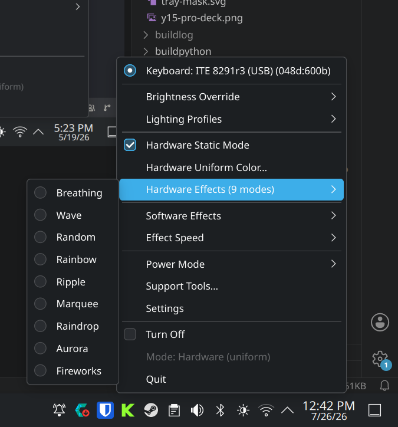 | 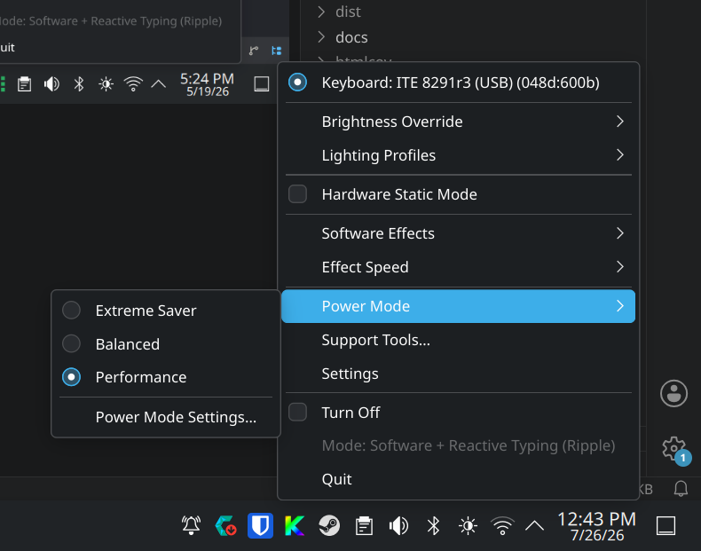 |

| **Per-Key Editor** | **Settings** |
|---|---|
| 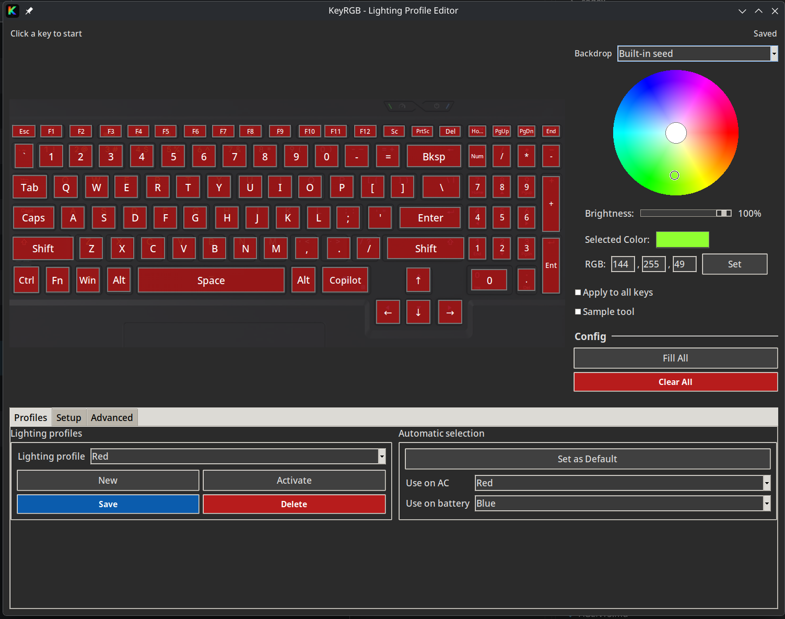 | 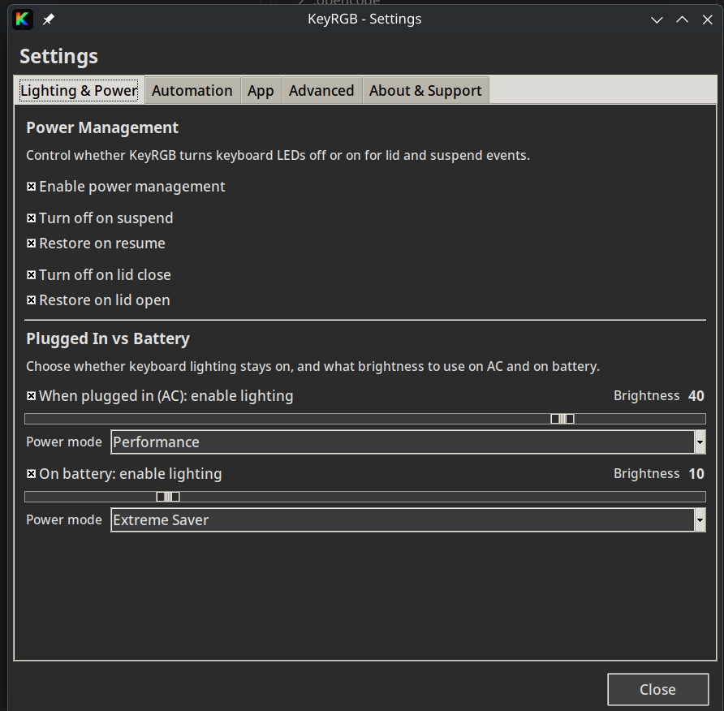 |

| **Tray Menu (Brightness)** | **RAM / CPU Usage** |
|---|---|
| 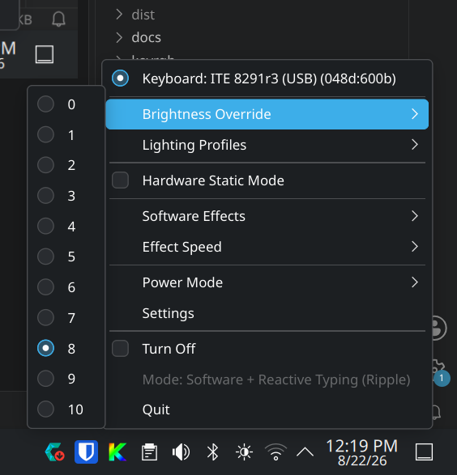 | 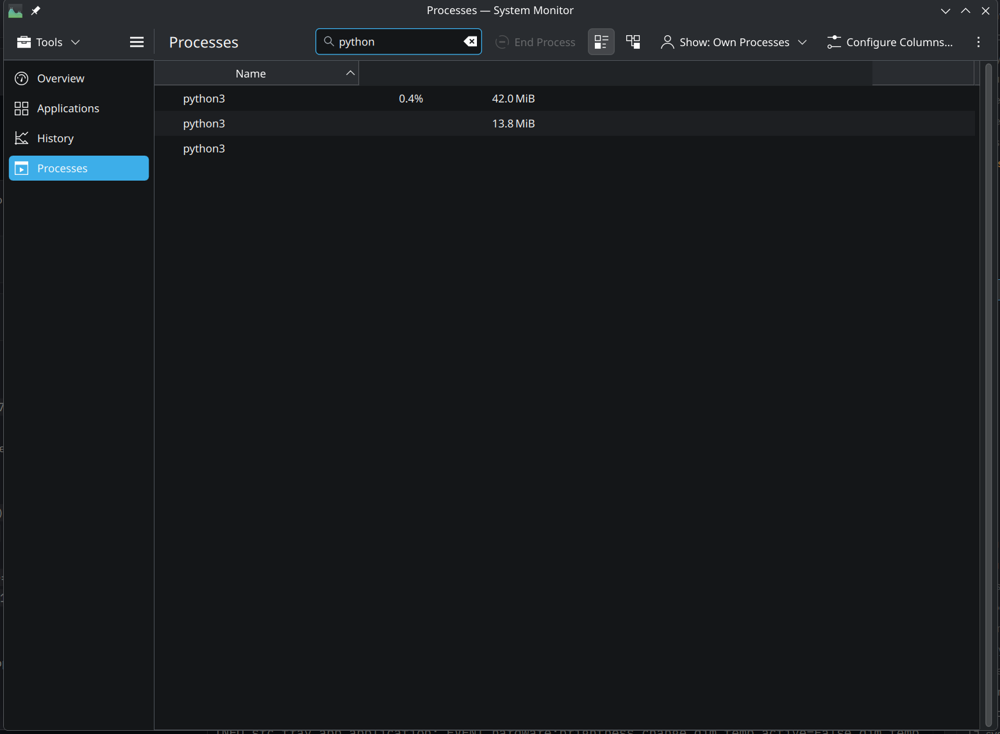 |

<details>
<summary><b>More screenshots</b></summary>

| **Tray Menu (Software Effects)** | **Tray Menu (Keyboard / Profiles)** |
|---|---|
| 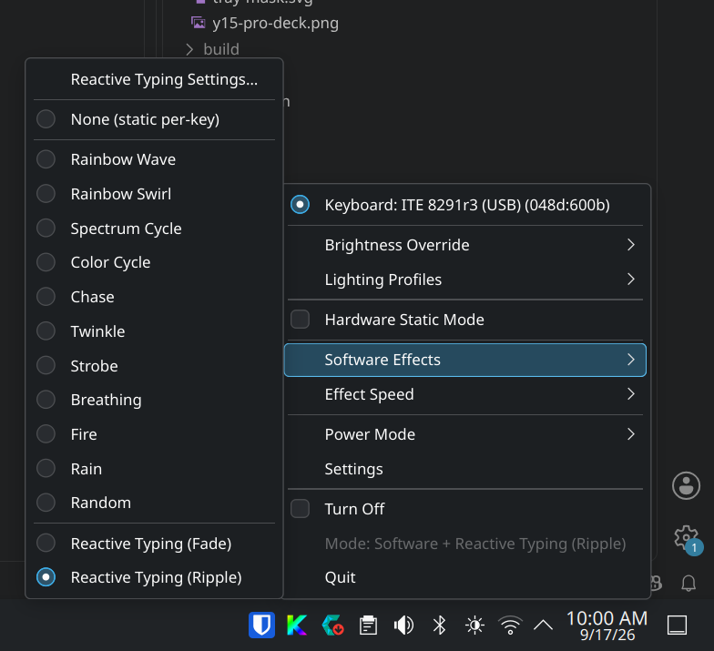 | 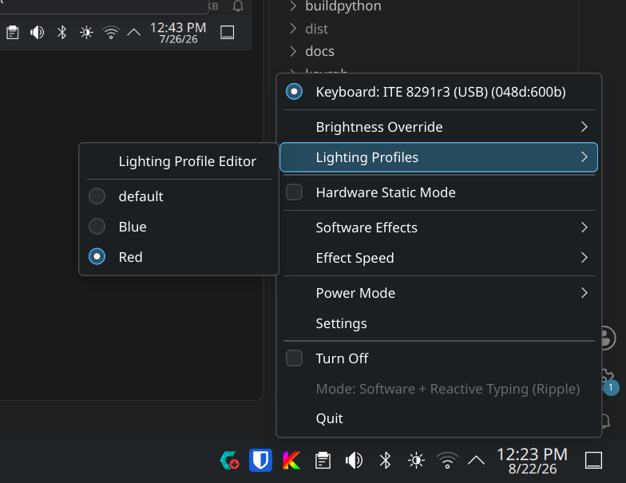 |

| **Uniform Color UI** | **Per-Key Calibrator** |
|---|---|
| 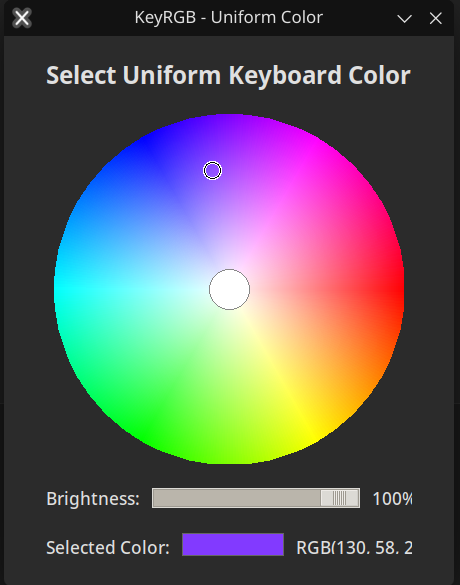 | 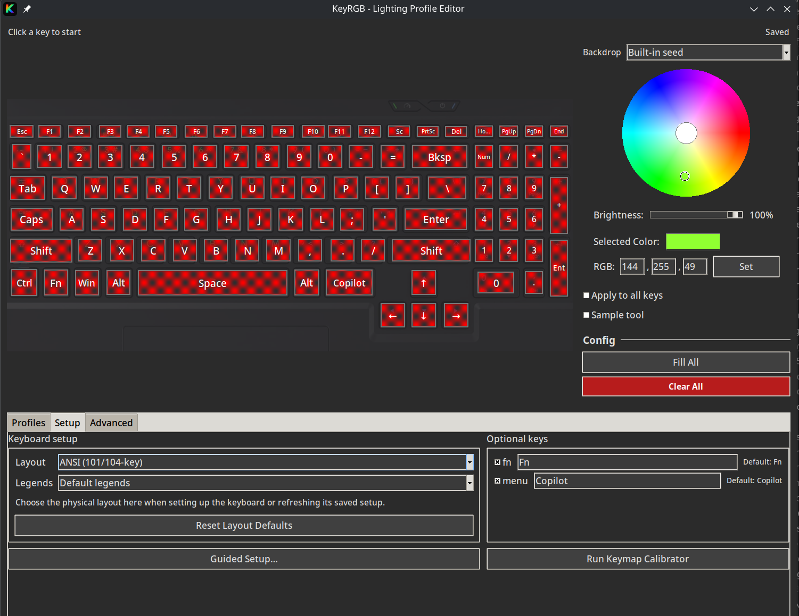 |

| **Keymap Calibration** | **Reactive Typing** |
|---|---|
| 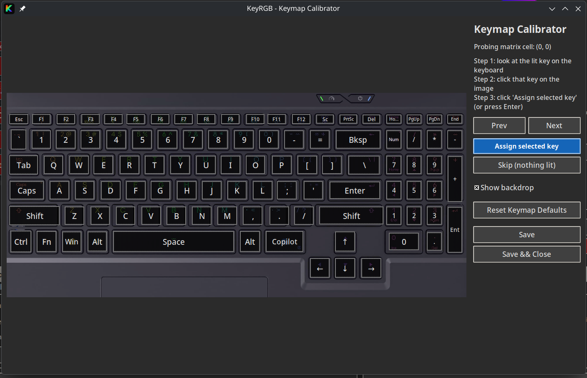 | 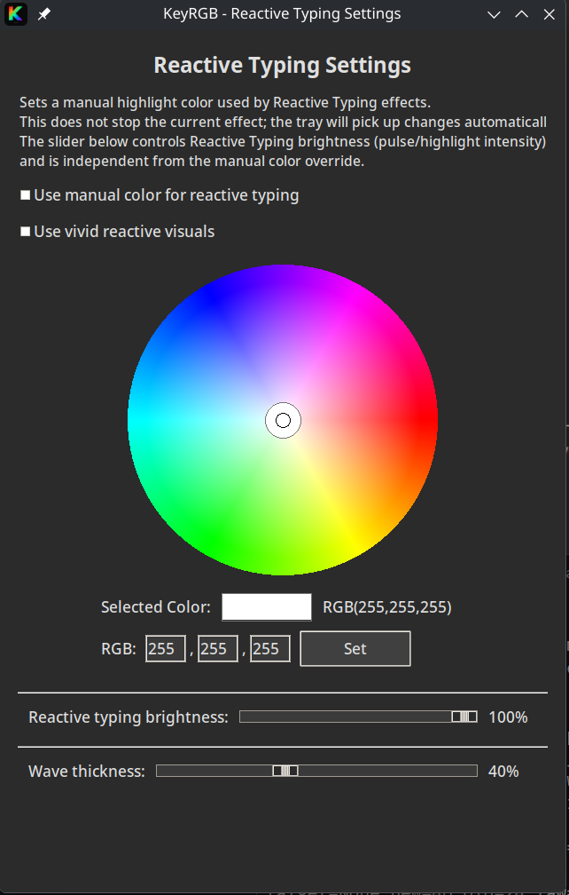 |

</details>

## Quickstart

For most users, use the AppImage installer. Only use a source checkout if you want to modify KeyRGB locally.

### Install and update

#### Standalone AppImage (recommended)

The installer downloads the AppImage, stores it as `~/.local/bin/keyrgb.AppImage`, installs the `~/.local/bin/keyrgb` launcher, and refreshes desktop integration. The AppImage bundles the runtime dependencies, so normal installs do not need Python/Tk GUI packages from your distro.

Standard install:

```bash
curl -fsSL https://raw.githubusercontent.com/Rainexn0b/keyRGB/main/install.sh -o install.sh && bash install.sh
```

Pinned release (reproducible bootstrap scripts):

```bash
curl -fsSL https://raw.githubusercontent.com/Rainexn0b/keyRGB/v0.33.1/install.sh -o install.sh && bash install.sh
```

AppImage install without system package changes:

```bash
curl -fsSL https://raw.githubusercontent.com/Rainexn0b/keyRGB/main/install.sh -o install.sh && bash install.sh --no-system-deps
```

Update an existing AppImage install:

```bash
curl -fsSL https://raw.githubusercontent.com/Rainexn0b/keyRGB/main/install.sh -o install.sh && bash install.sh --update-appimage
```

Notes:

- Some integration steps may prompt for `sudo` when installing udev or polkit rules.
- `--update-appimage` also refreshes desktop integration and removes stale legacy KeyRGB PNG icons from older installs when the current SVG icon is available.
- `--no-system-deps` only skips system package changes; it still downloads and installs the AppImage.
- On Arch/CachyOS, install `fuse2` for native AppImage/FUSE launching: `sudo pacman -S --needed fuse2`. KeyRGB also installs a launcher wrapper that falls back to `--appimage-extract-and-run` when `libfuse.so.2` is unavailable.
- On Debian/Ubuntu/Linux Mint, the AppImage path is usually enough for a first install. Optional kernel-driver installs are best-effort and may require TUXEDO package sources; KeyRGB does not add third-party apt repos automatically.
- The installer bootstraps sub-scripts from the pinned release tag by default. To override, pass `--ref <git-ref>` or set `KEYRGB_BOOTSTRAP_REF=<git-ref>`.

### Uninstall

Interactive uninstall:

```bash
curl -fsSL https://raw.githubusercontent.com/Rainexn0b/keyRGB/main/uninstall.sh -o uninstall.sh && bash uninstall.sh
```

Non-interactive uninstall of the AppImage install and desktop entries:

```bash
curl -fsSL https://raw.githubusercontent.com/Rainexn0b/keyRGB/main/uninstall.sh -o uninstall.sh && bash uninstall.sh --yes --remove-appimage
```

<details>
<summary><b>Advanced usage and source checkout</b></summary>

#### Clone and install for local development

```bash
git clone https://github.com/Rainexn0b/keyRGB.git
cd keyRGB
./install.sh --dev
```

This installs system dependencies as needed and installs KeyRGB in editable mode. Fedora/Nobara and Arch/CachyOS are the main tested development targets; other distros are best-effort.

From a checkout, run the tray with `./keyrgb.sh` or `python -m keyrgb.tray`. The import root is the `keyrgb` package (not `src`).

#### Uninstall from a local checkout

```bash
./uninstall.sh
./uninstall.sh --yes --remove-appimage
```

#### Installer arguments

| Argument | Meaning |
| --- | --- |
| `--appimage` | Download AppImage (default). |
| `--dev` | Developer install in editable mode. |
| `--pip` | Legacy alias for the editable developer install. |
| `--clone` | Clone repo and install from source. |
| `--clone-dir <path>` | Clone target directory. |
| `--version <tag>` | Install a specific tag such as `v0.33.1`. |
| `--asset <name>` | Override the AppImage filename. |
| `--prerelease` | Allow prereleases when resolving the latest AppImage. |
| `--no-system-deps` | Skip system package changes such as kernel-driver or polkit installs. |
| `--update-appimage` | Refresh an existing AppImage install and desktop integration. |
| `--ref <git-ref>` | Download installer modules from a specific git ref. |

Full non-interactive install example:

```bash
curl -fsSL https://raw.githubusercontent.com/Rainexn0b/keyRGB/main/install.sh -o install.sh && \
	KEYRGB_INSTALL_KERNEL_DRIVERS=y \
	KEYRGB_INSTALL_INPUT_UDEV=y \
	bash install.sh
```

</details>

### Run

If you installed via the installer, run KeyRGB from your app menu or start it from a terminal:

| Command | Description |
| --- | --- |
| `keyrgb` | Start the tray app (background). |
| `keyrgb --diagnostic-session` | Run the canonical foreground diagnostic session; saves debug logs, before/after diagnostics, and journal slices in a timestamped cache directory. |
| `keyrgb-diagnostic-launch` | Same diagnostic session as a dedicated command. From a checkout it uses source code; otherwise it uses the installed runtime. |
| `keyrgb --capture-runtime-log` | Capture only a foreground runtime log. |
| `./keyrgb.sh` | Run attached to the terminal from a source checkout. |
| `keyrgb-perkey` | Open the per-key editor. |
| `keyrgb-uniform` | Open the uniform-color GUI. |
| `keyrgb-reactive-color` | Open the reactive typing color GUI. |
| `keyrgb-calibrate` | Open the keymap calibrator UI. |
| `keyrgb-settings` | Open the settings GUI. |
| `keyrgb-diagnostics` | Print hardware diagnostics JSON. |

**Switching between devices:** when a supported auxiliary lighting device (or a
composite controller's extra surfaces, such as the Legion Gen10 **Logo / Neon
Strip / Vents**) is present, each surface appears as a selectable row at the top
of the tray menu. Click a row to swap the menu into that device's own controls
(uniform color, capability-aware brightness, and on/off). Shared controller zones
explicitly follow the Keyboard brightness, while independent devices get their own
slider. Click the **Keyboard** row to return to the main keyboard controls. These rows
select live controls; **Lighting Profiles** remains the persistent whole-scene editor.

## Hardware compatibility

Support is **controller-specific**, not brand-wide. Two laptops with the same
badge can use different ITE chips or only a brightness-only sysfs backlight.
When unsure, run `lsusb` (look for `048d:`) and `keyrgb-diagnostics`.

| Family | Typical evidence | Backend | Stability | What you get |
| --- | --- | --- | --- | --- |
| TongFang / XMG / Wootbook / Eluktronics / many rebrands | USB `048d:ce00` or similar ITE | `ite8291r3_perkey` | validated | Per-key RGB when the firmware exposes it |
| Clevo / TUXEDO (kernel RGB) | `/sys/class/leds` via `tuxedo-drivers` or `clevo-xsm-wmi` | `sysfs-leds` | validated | RGB or brightness-only, whatever sysfs exposes |
| System76 | ACPI keyboard backlight in sysfs | `sysfs-leds` | validated | RGB when the kernel exposes color attributes |
| Many other Linux laptops | `*kbd_backlight*` in `/sys/class/leds` | `sysfs-leds` | validated | Often **brightness only** — that is a valid backend |
| ASUS ROG / Aura | `asusctl` / rog-control-center | `asusctl-aura` | validated | Aura zones (virtual per-key via zone bucketing) |
| Lenovo Legion 5 / Pro 5 Gen10 | `048d:c195` | `ite8258_zones_lenovo_legion` | experimental | 24-zone keyboard |
| Lenovo Legion Pro 7 Gen10 | `048d:c197` | `ite8258_perkey_chassis` | experimental | Per-key keyboard plus logo / neon / vent |
| Lenovo IdeaPad / Legion 4-zone | `048d:c963` and related PIDs | `ite8295_zones_lenovo_ideapad` | experimental | 4-zone keyboard |
| Clevo / TUXEDO lightbar | `048d:7001` / `7000` / `6010` | `ite8233_none_chassis_lightbar_clevo` | experimental | Lightbar only, no keyboard deck |

Wootbook and Lenovo Gen10 USB devices usually need the udev rules in
`system/udev/99-ite8291-wootbook.rules` for hidraw/USB access.

Brightness-only sysfs backends are first-class. KeyRGB will not invent RGB or
per-key control from a backlight that only exposes `brightness`.

## Backends

Selection is **sysfs first**, then USB/HID userspace, then ASUS Aura when
`asusctl` is present. Automatic selection only considers **validated** backends
unless you opt in to experimental ones (**Settings → Backend policy** or
`KEYRGB_ENABLE_EXPERIMENTAL_BACKENDS=1`).

| Backend | Stability | Role |
| --- | --- | --- |
| `sysfs-leds` | validated | Kernel `/sys/class/leds` (TUXEDO / Clevo / System76 / generic backlight) |
| `ite8291r3_perkey` | validated | TongFang-class USB per-key (control transfer) |
| `ite8910_perkey` | validated | ITE 8910 per-key HID |
| `asusctl-aura` | validated | ASUS Aura via `asusctl` |
| `ite8291_perkey` | experimental | ITE 8291 HID per-key |
| `ite8291_zones_clevo` | experimental | 4-zone Clevo / TUXEDO |
| `ite8258_zones_lenovo_legion` | experimental | Legion 5 / Pro 5 Gen10 24-zone |
| `ite8258_perkey_chassis` | experimental | Legion Pro 7 Gen10 per-key + chassis |
| `ite8295_zones_lenovo_ideapad` | experimental | IdeaPad / Legion 4-zone family |
| `ite8297_uniform` | experimental | Uniform-color ITE 8297 |
| `ite8233_none_chassis_lightbar_clevo` | experimental | Clevo lightbar |
| `sysfs-mouse` | experimental | Auxiliary mouse LEDs in sysfs; never auto-selected as the keyboard |

Older `KEYRGB_BACKEND` values such as `ite8291r3`, `ite8258`, and
`ite8291-zones` still resolve through aliases. Prefer the canonical names
above. Full naming rules, PID lists, and alias tables live in
[keyrgb/core/backends/README.md](keyrgb/core/backends/README.md).

Known limitation: some `ite8291r3_perkey` laptops briefly blank the keyboard on
AC unplug/replug before KeyRGB can repaint it. See
[backend limitations](docs/B-backend-guides/backend-limitations.md).

The installer can optionally help install Clevo/TUXEDO kernel modules and always
installs the matching KeyRGB udev rules for supported USB / hidraw access.

### Environment variables

| Variable | Usage |
| --- | --- |
| `KEYRGB_BACKEND` | Force a backend (`auto` default). Canonical names are listed above; old short names still work as aliases. |
| `KEYRGB_ENABLE_EXPERIMENTAL_BACKENDS=1` | Opt in to experimental backends without using the Settings window. |
| `KEYRGB_ITE8295_ZONES_HIDRAW_PATH` | Override `/dev/hidraw*` for `ite8295_zones_lenovo_ideapad`. |
| `KEYRGB_ITE8297_HIDRAW_PATH` | Override `/dev/hidraw*` for `ite8297_uniform`. |
| `KEYRGB_ITE8233_HIDRAW_PATH` | Override `/dev/hidraw*` for the Clevo lightbar backend. |
| `KEYRGB_ITE8910_HIDRAW_PATH` | Override `/dev/hidraw*` for `ite8910_perkey`. |
| `KEYRGB_HID_REPORT_DELAY_MS` | Milliseconds to sleep between USB HID reports (default `1`). Increase if the controller resets under heavy frames; `0` disables pacing. |
| `KEYRGB_<BACKEND>_REPORT_DELAY_MS` | Per-backend HID pacing, punctuation normalized to underscores (for example `KEYRGB_ITE8291R3_PERKEY_REPORT_DELAY_MS`). Falls back to `KEYRGB_HID_REPORT_DELAY_MS`. |
| `KEYRGB_DEBUG=1` | Enable verbose debug logging. |
| `KEYRGB_DEBUG_BRIGHTNESS=1` | Detailed brightness / sysfs write logs. Example: `KEYRGB_DEBUG_BRIGHTNESS=1 ./keyrgb.sh`. |
| `KEYRGB_DEBUG_REACTIVE_INPUT=1` | Log reactive-effect key input. It is included by the `full` capture and diagnostic-session modes. |
| `KEYRGB_TK_SCALING` | Float override for UI scaling (High-DPI / fractional scaling). |
| `KEYRGB_RECOVERY_USER_MODE_SAVE` | After hidden controller-sleep recovery, save the restored scene as the controller's user mode (default on). Set to `0` to opt out. |

### Tray effects (names)

These are the effect names stored in `~/.config/keyrgb/config.json` under the `effect` key.

- Hardware (firmware) effects: backend-specific. Common legacy values include `rainbow`, `breathing`, `wave`, `ripple`, `marquee`, `raindrop`, `aurora`, `fireworks`.
- Software effects: `rainbow_wave`, `rainbow_swirl`, `spectrum_cycle`, `color_cycle`, `chase`, `twinkle`, `strobe`
- Reactive typing: `reactive_fade`, `reactive_ripple`
- Per-key static map: `perkey`

When a hardware effect name collides with a software effect name, KeyRGB stores the hardware selection with an `hw:` prefix to preserve the user's choice. Example: hardware `spectrum_cycle` is stored as `hw:spectrum_cycle`.

When compatible auxiliary devices are present, **Software Effects** includes an
`Include enabled lighting areas` toggle. It controls animated fan-out only;
static output always follows the active profile.

## Status

- **Beta**: versioning follows **0.x.y**. Public commands and on-disk config stay compatible across the 0.33.x series; Python import paths are `keyrgb.*`.
- Installer support is validated on Fedora/Nobara and Arch/CachyOS; other distro families are staged, best-effort.
- Hardware support depends on the specific controller and firmware, not the laptop badge. See **Hardware compatibility** and **Troubleshooting**.

### Distro support

| Profile | Status | Notes |
| --- | --- | --- |
| Fedora / Red Hat family | Tested | AppImage plus optional `dnf` helpers is the smoothest path. |
| Debian / Ubuntu / Linux Mint | Experimental | AppImage-first. Optional apt kernel-driver installs are best-effort and may need TUXEDO package sources. |
| Arch / CachyOS / EndeavourOS / Manjaro | Tested | AppImage-first. KeyRGB does not install AUR DKMS packages automatically. |
| openSUSE / other Linux | Best-effort | AppImage-first. Package names vary; manual driver setup may still be required. |

## Configuration

### Settings and autostart

Access **Settings** via the tray menu to configure:

- **Power Management**: toggle LEDs on Suspend/Resume or Lid Close/Open.
- **Screen idle/blanking sync**: optionally turn the keyboard off (or drop to a temporary brightness) when the screen idles/blanks, with an adjustable fade duration. You can also let the keyboard controller's own sleep timeout turn the backlight off (ITE firmware blanks the deck after ~10 minutes without typing; it lights again on the next input).
- **Autostart**: enable “Start KeyRGB on login”.
- **Backend policy**: opt in to experimental backends. The UI labels experimental paths as speculative or research-backed.

The tray's **Power Mode** submenu exposes the lightweight CPU power controls. Use **Power Mode Settings…** there to adjust the Extreme Saver target and review what each mode does.

### Profiles

Profiles are stored in:

`~/.config/keyrgb/profiles/`

Each profile contains the keymap (calibration), global overlay tweaks, keyboard color
data, and enabled/color state for secondary lighting areas. Independently dimmable
secondary devices also store brightness. Manage the complete scene through the
Lighting Profile Editor.

### Per-key calibration

Most supported controllers use a fixed LED matrix (e.g., 6×21). To map this to your physical layout:

1. Open `keyrgb-perkey`.
2. Click **Run Keymap Calibrator**.
3. Click the corresponding key on-screen as each physical LED lights up.
4. Save the keymap.

## Troubleshooting

| Issue | Solution |
| --- | --- |
| No tray icon | Run `keyrgb` from a terminal to see errors. Check if the system tray extension is enabled (GNOME). |
| Permission denied | Ensure KeyRGB udev rules are installed. Try replugging the device or rebooting/logging out so `uaccess` is refreshed. |
| `0x048d:0x8910` is detected but not working | Ensure udev rules are installed and you have rebooted or logged out. Run `keyrgb-diagnostics` to check backend selection. |
| Flickering effects | Ensure other tools (OpenRGB, TCC) are not running. KeyRGB needs exclusive access. |
| Per-key not working | You likely need to run the Keymap Calibrator first. |
| Brightness works but color does not (kernel / `kbd_backlight`) | The sysfs node is likely **brightness-only** (no `multi_intensity`, `color`, or `rgb` under `/sys/class/leds/*kbd_backlight*`). KeyRGB can only change color when the kernel exposes RGB attributes. On ASUS ROG, use `asusctl` / rog-control-center for Aura/RGB. |
| Per-key editor not available | The editor needs a backend that can address individual LEDs (typically USB ITE / TongFang). Many kernel drivers expose only uniform brightness, and sometimes uniform RGB, not per-key RGB. |
| Keyboard backlight turns off by itself after ~10 minutes without typing | This is the ITE controller's own firmware sleep timer; host software cannot disable it. By default KeyRGB re-lights the deck automatically (a brief blink). To leave it dark until the next keypress, enable **Settings → Screen idle/blanking sync → "Let the controller's own sleep timeout turn the keyboard off"**. |

For a suspend/resume or runtime problem, use **Diagnostic Session** from the KeyRGB app-menu entry (after reinstalling to refresh desktop integration), or run:

```bash
keyrgb --diagnostic-session
```

It opens in the foreground so you can close an already-running tray first, reproduce the issue, then press `Ctrl-C`. The printed session directory under `~/.cache/keyrgb/diagnostic-sessions/` contains `keyrgb-debug.log`, diagnostics snapshots, and best-effort journal slices. Review the bundle for personal information before sharing it.

## Hardware support and contributing

If KeyRGB detects your device but behaves oddly, or if you have a new laptop model (TongFang/Clevo/etc.), please help us support it.

For support routing, see [SUPPORT.md](SUPPORT.md). For contributor workflow details, see [CONTRIBUTING.md](CONTRIBUTING.md).

1) Run diagnostics:

```bash
keyrgb-diagnostics
```

2) Open an issue:

- https://github.com/Rainexn0b/keyRGB/issues/new/choose

Select **Hardware support / diagnostics** and paste the JSON output from step 1.

3) Include details:

- Laptop model (e.g., XMG Core 15, Tuxedo InfinityBook)
- USB ID (run `lsusb | grep -i "048d:"`)
- Description of what works vs. what fails

### Privacy note

`keyrgb-diagnostics` attempts to sanitize output, but please review the JSON before posting to ensure no personal paths/names are included.

## Acknowledgements

KeyRGB is an independent platform with its own backend abstraction, power-management engine, and udev system. Some backend implementations were informed by device-support research from the Linux RGB community, including OpenRGB. Where OpenRGB data informed an implementation, the backend was independently reimplemented in Python for KeyRGB's custom layer. KeyRGB does not vendor, wrap, or directly reuse OpenRGB source code.

## License

GPL-2.0-or-later.
